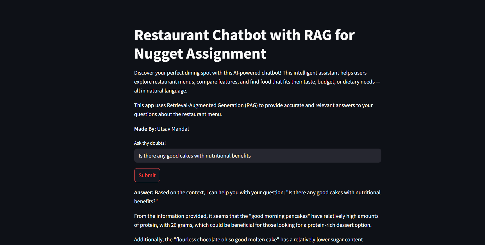

# 🍽️ Restaurant Chatbot with RAG - Zomato Nugget Internship



Welcome to the **Restaurant RAG Chatbot**, built for the **Zomato Nugget Internship 2025**. This intelligent assistant helps users explore restaurant menus, compare items, and find food tailored to their tastes and budgets — all via natural language!

---

## 🚀 Features

- 🔍 **Domain-specific RAG using** `bitext/Mistral-7B-Restaurants`
- ⚡ Semantic search with `minsearch` over restaurant menu embeddings
- 🧠 Retrieval-Augmented Generation with prompt-aware answers
- 📈 Relevance scoring of each generated response
- 🎨 Intuitive **Streamlit UI** with interactive Q&A history

---

## 🧠 How It Works

1. User asks a question (e.g., "What desserts are under ₹200?")
2. Relevant chunks are retrieved using vector similarity from `minsearch`
3. Prompt is dynamically built using retrieved chunks
4. `bitext/Mistral-7B-Restaurants` (via Hugging Face Inference API) generates the answer
5. The chatbot self-evaluates relevance and response time

---

## 📦 Installation

```bash
git clone https://github.com/yourusername/zomato-rag-chatbot.git
cd zomato-rag-chatbot
python -m venv venv
source venv/bin/activate   # Windows: venv\Scripts\activate
pip install -r requirements.txt


🔐 Environment Variables
Create a .env file and add the following:

env
Copy
Edit
API_HOST=huggingface
HUGGINGFACEHUB_API_TOKEN=your_huggingface_api_key
HUGGINGFACE_MODEL=bitext/Mistral-7B-Restaurants
▶️ Run the App
bash
Copy
Edit
streamlit run app.py
Open http://localhost:8501 in your browser to start using the chatbot.
